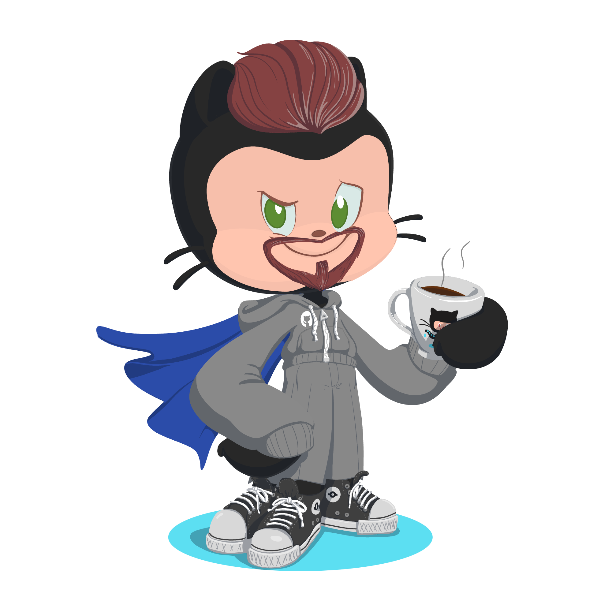

## Salam 👋

I'm **Yousef** (You can call me Joey), a *Software Engineer II* [@Github](https://www.github.com).

### About Me

- 🔭 I’m currently part of the Observability Expreience team
- 🌱 I’m currently learning Go, Ruby, Docker, Kubernetes
- 👯 I’m looking to collaborate on all kinds of open source projects
- ⚡ Fun fact: I'm way older than what I look 🙈

### Connect with Me

### Languages and Tools

### GitHub Stats

### Top Languages

